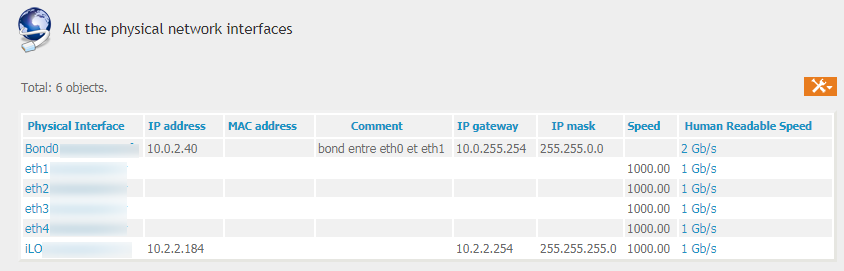
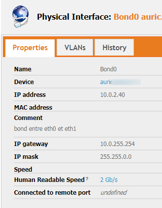
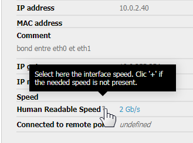
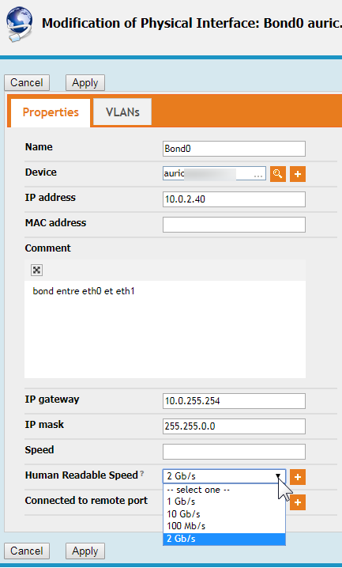
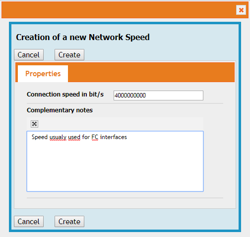
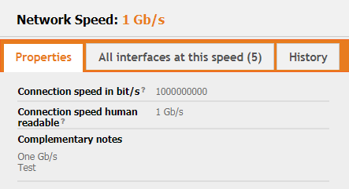
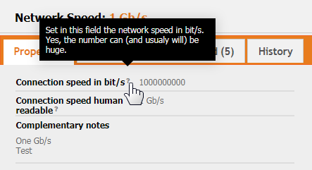
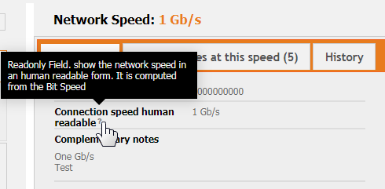
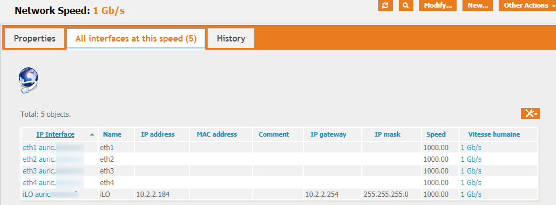

# iTop-Network-Speed

[TOC]

# Goal

Adds a Network Speed Classes, for interfaces. so, instead of write down the speed for each interface, you select the speed from a combo box.

This allow to also find all interfaces running at the same speed.

While this extension is (hopefully) totally useable, this is more a study case :

Inside the 'Speed Class', you set a speed in bits/S.

And yes, that give very big numbers for current network speed : 10 G is 10 000 000 000 ! But I still think that a number as to be stored 'as is', and not with a supposed translation (one could choose that all speed are expressed in Mb/s, and the other could think they are Kb/s)

But 10000000000 is not really 'Human friendly'. So, as soon as you set-up a speed in b/s, another field is computed in more friendly way. So you set-up 10000000000 and you read 10 Gb/s

## Status

While completely usable in my opinion, this add-on is more a case study. However, I'll be more than happy if it can help some persons.

What should be done :

* Maybe some direct access to the NetworkSpeed class (From menu, or elsewhere)
* At this time, it is possible to create more than one speed at the same speed. This is a 'bug in progress', I hope to find a solution (not my top level priority...)
* For now, the legacy 'Speed' field is still present. It is really easy to hide, but I suspect that some useful information can be there...
* I set a compatibility with iTop >= 2.3.0, because it seems that it should work but honestly, I only tested on iTop 2.6.1
* .... What else ?

# Installation

As for all my extensions, just download the zip file, and copy the 'schirrms-...' directory in your extensions directory, then rerun the setup as usual.

# Usage

After installing this extension, You'll see a new field in the 'Network Interface' Tab of a server (for instance).

If you have already interfaces defined, the view would be :



Opening an interface view give that :




If you have installed one of the great Molkobain's extension, then you'll see the question mark, and, hovering the mouse over the question mark, you'll see :



If you modify the interface, you'll see a drop down box for the speed :



Just click '+' if the desired speed is not present in the drop down box.



At this point, the 'Human Speed' is totally hidden. It will be computed at the Speed Creation.

If, from a physical interface, you click on one of the 'Human Speed', you get the details for this speed :



Again, should you use a Molkobain extension, you got your hints :)





From the 'Network Speed view, in the tab 'All interfaces at this Speed, you get ... all interfaces at this speed !




## Export/Import

Because iTop is a very smart product, the call to the function computing the Human Speed is also done when importing data.

So, via 'Data Administration' --> 'CSV Import' I copy/paste these data :

```
`"Complementary notes","Connection speed in bit/s"
"One Gb/s 
Test",1000000000
"10 Gb / s",10000000000
"20 Gb/s, mostly two 10 Gb/s aggegated",20000000000
"100Mb / s",100000000
"2 GB/s mostly an aggregation of two 1Gb/s",2000000000
"Speed usualy used for FC interfaces",4000000000
"Speed usualy used for FC interfaces",8000000000
"Speed usualy used for FC interfaces",16000000000
"Mostly use between our Juniper switches",40000000000`
```

And in iTop, I get the new entries, with the 'Human Speed' set.

# For developers/Curious people

This presentation package is there mostly because I really had troubles collecting all the informations needed to create a field

* Read Only
* Updated from another values 

So I hope it can be useful to others (and maybe also to me, next time I'll forget my former work...)

That being said, from a developer's perspective :

* The 'so great' SetHumanSpeed should probably not be directly in this extension, but be set as a public function that can be called elsewhere. For the sake of simplicity, I found it easier to put it directly in the datamodel file.

* I'm not fan of PHP embedded in the XML file, but I don't know of to put the functions in a separate file and to link them to the standard call in iTop

* And, as usual : I'm not a developer, so I won't pretend that my work is clean. But it works :)

  

# Discussion

I really would appreciate any advices, don't hesitate to share your toughs in the iTop Forum :

https://sourceforge.net/p/itop/discussion/922360/thread/3277f54512/

# Thanks

To Combodo, of course :)

To the whole iTop Forum, that i read a lot (even i i don't answer so much)

Special thanks for Molkobain/Guillaume who help so much.